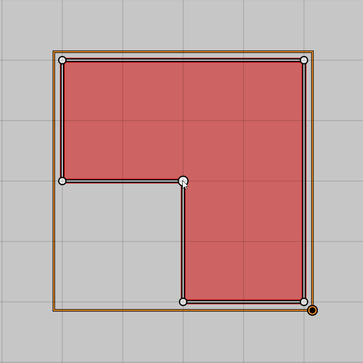
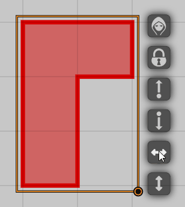
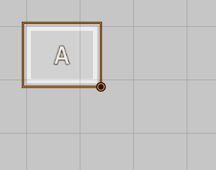
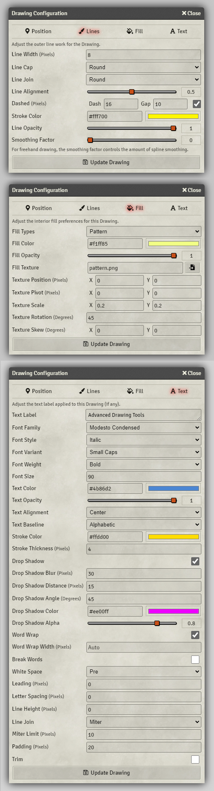
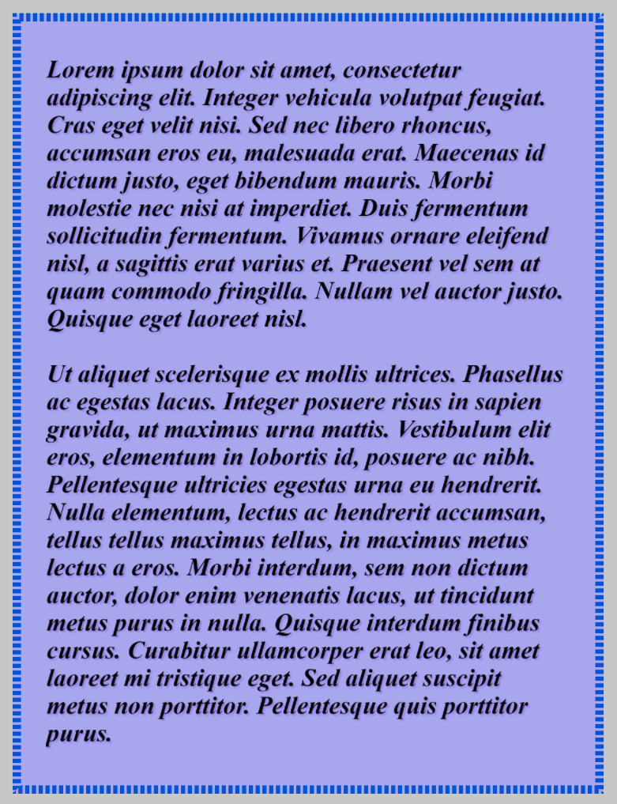

# Advanced Drawing Tools (Foundry VTT Module)

## Feature Overview

- Various additional line, fill, and text style options.
- Editing of polygon drawings.
  - Left drag node to move it.
  - Left drag edge to create a new node on it.
  - Right click node to delete it.
  - Right click edge to delete it.
- Buttons for flipping drawings.
- Multiline text label support.
- Newline in text drawings with SHIFT+Enter.
- Higher text quality.

